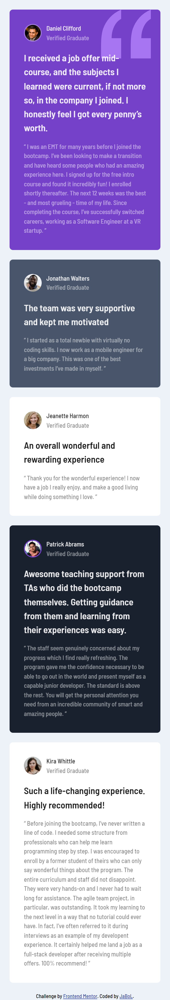
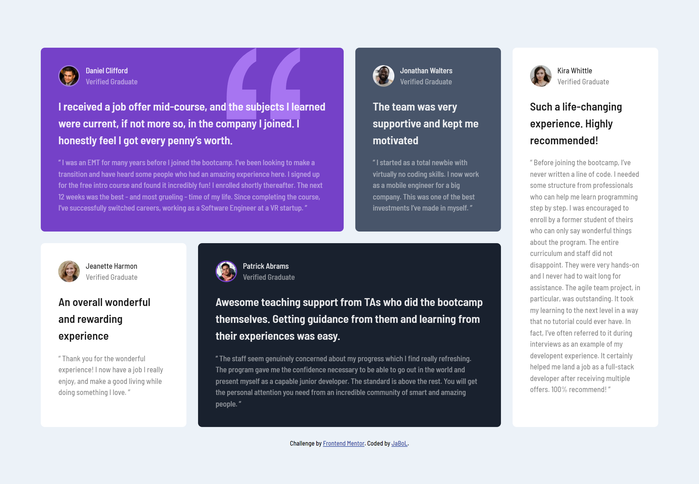

# Frontend Mentor - Testimonials grid section solution

This is a solution to the [Testimonials grid section challenge on Frontend Mentor](https://www.frontendmentor.io/challenges/testimonials-grid-section-Nnw6J7Un7). Frontend Mentor challenges help you improve your coding skills by building realistic projects. 

## Table of contents

- [Overview](#overview)
  - [The challenge](#the-challenge)
  - [Screenshot](#screenshot)
  - [Links](#links)
- [My process](#my-process)
  - [Built with](#built-with)
  - [What I learned](#what-i-learned)
  - [Continued development](#continued-development)
- [Author](#author)

## Overview

### The challenge

Users should be able to:

- View the optimal layout for the site depending on their device's screen size

### Screenshot

### Links

- Solution URL: [Front-end Solution](https://www.frontendmentor.io/solutions/testimonials-grid-section-MeJrYSmgYO)
- Live Site URL: [Website](https://errorrebirth.github.io/testimonials-grid-section/)

## My process

### Built with

- Semantic HTML5 markup
- CSS custom properties
- Flexbox
- CSS Grid
- Mobile-first workflow

### What I learned

I learned how css gird works. CSS Grid is a powerful tool for creating flexible and responsive layouts, and is well-suited for tasks such as creating multi-column layouts, creating grids of items with varying sizes, and aligning elements on a webpage. It is supported by all modern browsers, and is a good alternative to using older layout techniques such as floats and tables.

### Continued development

I want to continue this development in the future using the sass.

### Useful resources

- [CSS Reset](https://gist.github.com/Asjas/4b0736108d56197fce0ec9068145b421) - This helped me for resetting the css format.
- [CSS Grid](https://www.w3schools.com/css/css_grid.asp) - This is an amazing article which helped me finally understand how grid works.

## Author

- Frontend Mentor - [@CodingDummies](https://www.frontendmentor.io/profile/CodingDummies)
